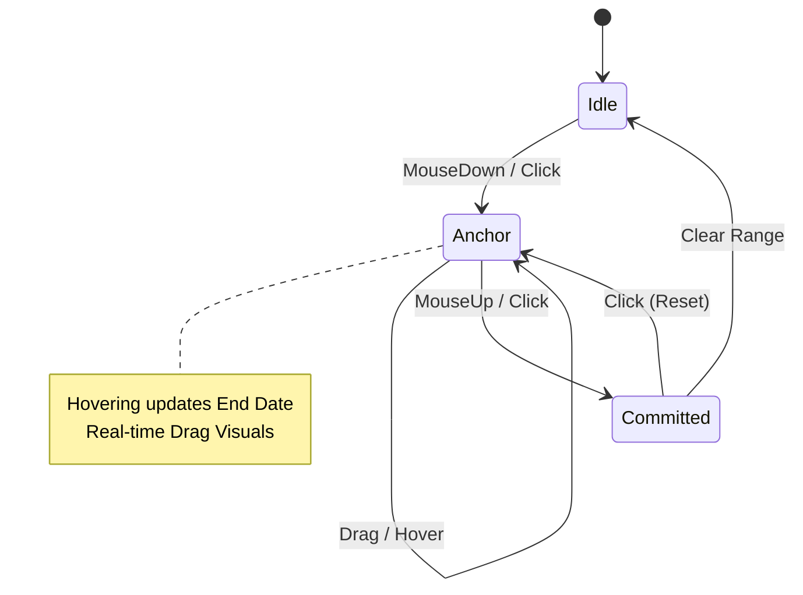

# LumaFlow 🌌

**Interactive. Precision Engineering for your Timeline.**

LumaFlow is a premium, high-performance Timeline Intelligence System and calendar interface built by **Tanmay**. It transcends standard flat UIs by recreating a tactile, physical wall calendar aesthetic powered by a rigorous state machine and natively fluid animations.


## 🚀 Features

- **Precision Range Selection**: Next-generation state machine supporting click-to-anchor, drag-to-select, and intelligent auto-reversing span limits.
- **Physical Calendar Emulation**: 3D `rotateY()` DOM flipping simulating a tactile notebook powered by Framer Motion.
- **Intent-Driven Theming**: The UI aggressively recalibrates its borders, glows, shadows, and tokens conditionally based on the task intent (Work, Personal, Urgent, General).
- **Contextual Intelligence**: Dynamically aggregates metrics (total events, memos) to compute your psychological "Prime Focus" based strictly on the selected range.
- **Smart Memory Chronicle**: Highly persistent, localized timeline data storage tied seamlessly to the DOM.
- **Dark Luxury / Light Modes**: A fully decoupled CSS variable system allowing flawless contrast transitions.

## 🧠 System State Engine

LumaFlow is driven by a deterministic state-machine residing in `useCalendar.ts` that safely manages the timeline interaction:



## 🛠️ Architecture & Tech Stack

- **Framework**: Next.js 16 (App Router)
- **Language**: TypeScript
- **Styling**: Tailwind CSS v4 & Native Vanilla CSS (`globals.css`)
- **Animation**: Framer Motion
- **Persistence**: LocalStorage (`lumaflow-core-v1`)

## 📦 Local Development

1. **Clone the repo**
   ```bash
   git clone https://github.com/Tanmay24-ya/LumaFlow.git
   ```

2. **Install dependencies**
   ```bash
   npm install
   ```

3. **Launch the Intelligence System**
   ```bash
   npm run dev
   ```

---

*Built with precision by Tanmay.*
